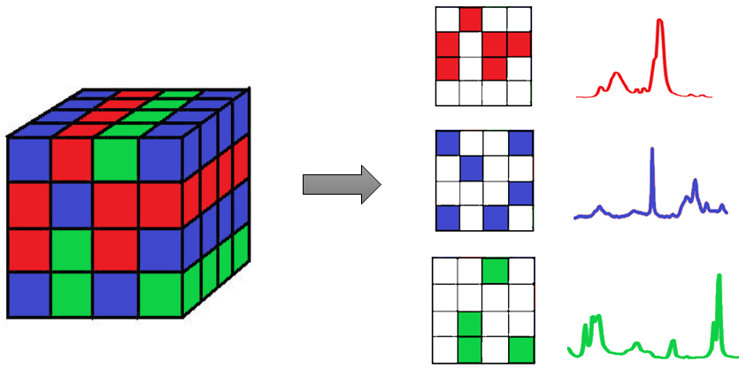

==============
Classification
==============

Hyperspectral classification uses labelled images to train a model which can then
be used to predict labels for new hyperspectral datasets. The techniques currently
available are listed below.

**Contents**

.. toctree::
    :maxdepth: 1

    svm
    naive_bayes
    neighbors