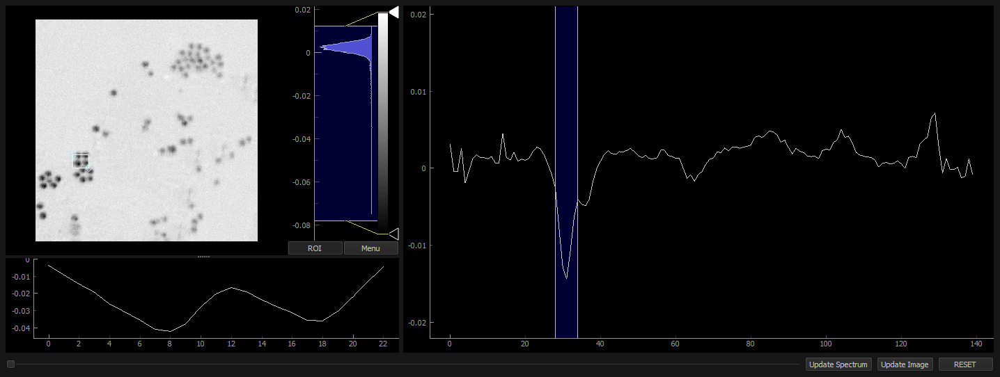

=========================
Hyperspectral data viewer
=========================

Included with `hypers` is a hyperspectral data viewer that allows for
visualization and interactivity with the hyperspectral dataset.

- From the :class:`~hypers.Dataset` instance variable:

    .. code-block:: python

        import numpy as np
        import hypers as hp

        test_data = np.random.rand(100, 100, 5, 512)
        X = hp.Dataset(test_data)

        X.view()

The hyperspectral data viewer is a lightweight pyqt gui. Below is an example:

    Hyperspectral data viewer.

.. note::

    If using ``hypers`` in a Jupyter notebook, it is still possible to use
    the data viewer. However the notebook cell will be frozen until the data
    viewer has been closed.

    This is due to the fact that the data viewer uses the same CPU process as the
    notebook. This may be changed in the future.
